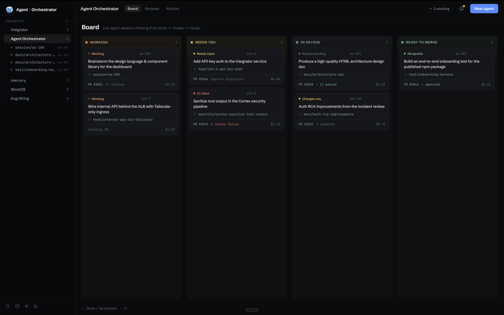
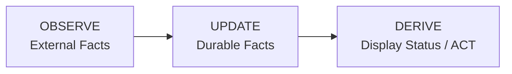

<div align="center">

<p align="center"></p>

# Modern Agent

**The orchestration layer for parallel AI coding agents**

[](https://github.com/modernagent/modern-agent/stargazers)
[](https://github.com/modernagent/modern-agent/graphs/contributors)
[](https://x.com/modernagent)
[](https://discord.com/invite/UZv7JjxbwG)
[](https://www.apache.org/licenses/LICENSE-2.0)

An Agentic IDE that supervises parallel AI coding agents in isolated workspaces, with complete control, workboard orchestration, and automatic feedback loops from CI failures, review comments, and merge conflicts.



</div>

---

## What is Modern Agent?

Modern Agent is a meta-harness agent IDE for running AI coding agents in parallel. It gives terminal-based agents like Claude Code, OpenAI Codex, Cursor, OpenCode, Aider, Goose, and 20+ others a shared workspace where their sessions, terminals, branches, pull requests, and feedback loops can be supervised from one place.

The agents still do the coding. Modern Agent provides the harness around them: isolated workspaces in git worktrees, live terminal multiplexing, durable session facts, PR awareness, workboard task orchestration, and automatic loops that send CI failures, review comments, and merge conflicts back to the right agent. Instead of manually juggling dozens of terminal windows, Modern Agent turns parallel agent work into a structured, observable workflow.

---

## Why Modern Agent?

AI coding agents become exponentially more productive when working in parallel, but coordinating parallel work gets messy quickly. Branches overlap, terminals get lost, CI failures need follow-up, review comments need replies, and merge conflicts have to reach the right worker.

Modern Agent is built to keep that loop visible, resilient, and manageable:

- **Work in true isolation**: Every session spawns into its own dedicated git worktree and platform-native terminal runtime.
- **Supervise across agents**: Run different agent CLIs side-by-side (e.g. Claude Code, Codex, Cursor, OpenCode, Antigravity) through a unified desktop supervisor and CLI.
- **Automated feedback loops**: CI failures, human review comments, and merge conflicts are continuously observed and routed back as agent nudges.
- **Workboard & Director orchestration**: Manage tasks with work cards, WIP limits, auto-dispatch, and autonomous multi-phase workflows (Plan, Build, Review, Test).
- **Durable & crash-proof**: Durable facts are stored in SQLite with CDC event streaming, computing derived display status at read time.

---

## How it works

At a high level, Modern Agent follows a reactive feedback loop:

1. **Add a project**: Register any local git repository with Modern Agent.
2. **Spawn sessions**: Start one or more sessions from the desktop app, CLI (`ao spawn`), or the Workboard auto-dispatcher.
3. **Isolated worktree**: Modern Agent creates an isolated git worktree for each session with a dedicated runtime (`tmux` on Darwin/Linux, `conpty` on Windows).
4. **Launch agent**: The selected coding agent harness executes inside the session's terminal runtime.
5. **Observe & broadcast**: The local daemon watches session state, terminal activity, pull requests, CI checks, and review feedback, streaming CDC updates over SSE.
6. **Interact & steer**: The desktop app and `ao` CLI provide live terminal multiplexing, notifications, PR management, and follow-up steering.

---

<div align="center">

[What is Modern Agent?](#what-is-modern-agent) • [Why Modern Agent?](#why-modern-agent) • [How it works](#how-it-works) • [Features](#features) • [Supported Agents](#supported-agents) • [Quick Start](#quick-start) • [CLI Reference](#cli-reference) • [Architecture](#architecture) • [Configuration](#configuration) • [Documentation](#documentation) • [Contributing](#contributing)

</div>

---

## Features

| Feature | Description |
| :--- | :--- |
| **Agent-Agnostic Platform** | **27 built-in agent adapters** including Claude Code, OpenAI Codex, Cursor, OpenCode, Antigravity (agy), Aider, Amp, Goose, GitHub Copilot, Grok, Qwen Code, Kimi Code, Cline, Continue, Devin, Droid, and custom commands |
| **Director & Workboard** | Kanban workboard with card auto-dispatch, WIP limits, phase progression, and Director agent orchestration |
| **Isolated Workspaces** | Each session runs in its own isolated git worktree with isolated branch and environment |
| **Platform-Native Runtimes** | Native PTY multiplexing via `tmux` on Darwin/Linux and `conpty` on Windows over WebSocket (`/mux`) |
| **Live PR Observation** | SCM observer with lazy GitHub auth, ETag-guarded polling, and semantic diffing across remotes and forks |
| **Automatic Feedback Loops** | Automatic agent nudges for CI test failures, PR review comments, and merge conflicts |
| **Durable Facts Storage** | SQLite persistence with goose migrations & sqlc queries; display status is derived at read time |
| **CDC Broadcasting** | DB triggers capture changes into `change_log`, broadcasted in real time via Server-Sent Events (SSE) |
| **Desktop Experience** | Electron + React 19 UI with TanStack Router/Query, Tailwind CSS, shadcn/Radix primitives, and xterm.js streaming |
| **Notification Center** | In-app notification center and system alerts for `needs_input`, `ready_to_merge`, `pr_merged`, and unmerged closures |
| **Thin CLI (`ao`)** | Comprehensive Cobra CLI client communicating strictly over loopback HTTP |
| **Loopback-Only Daemon** | HTTP daemon bound strictly to `127.0.0.1` with no auth, CORS, or TLS required by design |

---

### Supported Agents

Modern Agent includes 27 built-in adapters for terminal and CLI-based coding agents:

- **Anthropic Claude Code** (`claude-code`)
- **OpenAI Codex** (`codex`)
- **OpenCode** (`opencode`)
- **Cursor Agent** (`cursor`)
- **Antigravity** (`agy`)
- **xAI Grok** (`grok`)
- **Qwen Code** (`qwen`)
- **GitHub Copilot CLI** (`copilot`)
- **Moonshot Kimi Code** (`kimi`)
- **Factory Droid** (`droid`)
- **Amp** (`amp`)
- **Crush** (`crush`)
- **Aider** (`aider`)
- **Block Goose** (`goose`)
- **Augment Auggie** (`auggie`)
- **Continue** (`continueagent`)
- **Cognition Devin** (`devin`)
- **Cline** (`cline`)
- **Kiro** (`kiro`)
- **Kilo Code** (`kilocode`)
- **Mistral Vibe** (`vibe`)
- **Pi** (`pi`)
- **AutoHand** (`autohand`)
- **OpenClaw** (`openclaw`)
- **Hermes** (`hermes`)
- **Director Agent** (`director`)
- **Custom Command** (`command`)

**If it runs in a terminal, it runs on Modern Agent.**

---

## Quick Start

### Prerequisites

| Requirement | Minimum | Recommended |
| :--- | :--- | :--- |
| **Go** | 1.25+ | Latest |
| **Node.js** | 20+ | Latest LTS (22+) |
| **Git** | 2.30+ | Latest |
| **npm** / **pnpm** | npm 10+ / pnpm 9+ | Latest |

**Optional dependencies:**
- `tmux` (macOS/Linux) — For Unix terminal runtime
- `gh` (GitHub CLI) — For authenticated GitHub SCM observation

### Installation

Download the latest release for your platform from [Releases](https://github.com/modernagent/modern-agent/releases/latest):

| Platform | Download |
| :--- | :--- |
| **macOS** | [Modern Agent.dmg](https://github.com/modernagent/modern-agent/releases/latest) |
| **Windows** | [Setup.exe](https://github.com/modernagent/modern-agent/releases/latest) |
| **Linux** | [Modern Agent.AppImage](https://github.com/modernagent/modern-agent/releases/latest) / `.deb` / `.rpm` |

### Running from Source

```bash
# 1. Clone the repository
git clone https://github.com/modernagent/modern-agent.git
cd modern-agent

# 2. Build and start the backend daemon via ao CLI
cd backend
go run ./cmd/ao doctor    # Check environment health
go run ./cmd/ao start     # Start daemon in background

# 3. Launch the desktop frontend
cd ../frontend
npm install
npm run dev               # Start Electron supervisor app
```

---

## CLI Reference

The `ao` command is a thin client that interacts with the local daemon via loopback HTTP:

```bash
# Daemon Lifecycle
ao start                         # Start the daemon in the background
ao stop                          # Gracefully stop the daemon
ao status [--json]               # Check daemon process and health status
ao doctor [--json]               # Run system diagnostic checks

# Project & Session Management
ao project add <path>            # Register a local repository as a project
ao project ls                    # List registered projects
ao spawn --project <id> --harness claude-code   # Spawn a new agent session
ao session ls                    # List active and past sessions
ao session get <session-id>      # View session details
ao session kill <session-id>     # Terminate a running session
ao session restore <session-id>  # Restore a terminated session
ao session cleanup               # Clean up terminated sessions and worktrees
ao send <session-id> "message"   # Send follow-up instruction to a session
ao preview [url]                 # Open session web preview in inspector

# Workboard & Orchestrator
ao workboard get <card-id>       # Fetch work card status and details
ao workboard card transition <card-id> --status <status>   # Transition card phase
ao orchestrator ls               # List active orchestrators

# Pull Requests & Reviews
ao pr list                       # List open pull requests across sessions
ao pr merge <pr-number>          # Merge an approved pull request
ao pr resolve-comments <pr-num>  # Resolve review comments
ao review list                   # List code reviews
ao review execute <project-id>   # Trigger review on a project

# Organization & Policy
ao org status                    # Show multi-company / holding org hierarchy
ao policy get <project-id>       # View approval gate policies
```

---

## Architecture

Modern Agent follows a clear three-stage pipeline:



- **Frontend**: Electron + React 19 desktop application with TanStack Router/Query, Tailwind CSS, shadcn/Radix UI, and xterm.js terminal emulator.
- **Backend Daemon**: Go daemon serving loopback REST endpoints, SSE event stream (`/api/v1/events`), and WebSocket terminal multiplexer (`/mux`).
- **Runtime**: `tmux` on macOS/Linux and `conpty` on Windows for platform-native PTY management.
- **Persistence**: SQLite with goose migrations; DB triggers capture changes into `change_log` for CDC streaming. Status is never stored—it is derived at read time from durable facts.
- **Adapters**: 27 agent harness adapters, git worktree workspace manager, and GitHub SCM provider.

For complete architectural details, see [docs/architecture.md](docs/architecture.md).

---

## Configuration

The daemon is configured entirely through environment variables with sensible defaults:

| Variable | Default | Purpose |
| :--- | :--- | :--- |
| `AO_PORT` | `3001` | Daemon loopback HTTP port |
| `AO_DATA_DIR` | `~/.ao/data` | SQLite database and data directory |
| `AO_RUN_FILE` | `~/.ao/running.json` | Daemon handshake and discovery file |
| `AO_REQUEST_TIMEOUT` | `60s` | REST API request timeout |
| `AO_SHUTDOWN_TIMEOUT` | `10s` | Graceful shutdown deadline |
| `AO_AGENT` | `claude-code` | Default compatibility agent harness |
| `AO_ALLOWED_ORIGINS` | `app://renderer` | CORS allowed origins (comma-separated) |
| `AO_WEB_UI_DIR` | `~/.ao/web` | Static SPA directory served at `/` (if present) |
| `AO_STALL_THRESHOLD` | `4m` | Inactivity threshold before flagging a session as stalled |
| `AO_STALL_AUTOKILL` | `on` | Auto-kill confirmed-stalled sessions (`on` / `off`) |
| `AO_ORG_HEARTBEAT` | `on` | Enable HQ heartbeat observer (`on` / `off`) |
| `AO_TELEMETRY_EVENTS` | `off` | Local telemetry event logging (`off` / `on`) |
| `AO_TELEMETRY_METRICS` | `off` | Local telemetry metric logging (`off` / `on`) |
| `AO_TELEMETRY_REMOTE` | `off` | Remote telemetry exporter (`off` / `posthog`) |
| `AO_TELEMETRY_POSTHOG_KEY` | - | PostHog project API key |
| `AO_TELEMETRY_POSTHOG_HOST` | `https://us.i.posthog.com` | PostHog ingestion host |
| `GITHUB_TOKEN` | - | GitHub personal access token for SCM observer |

### Health Checks

```bash
curl http://127.0.0.1:3001/healthz   # Liveness probe
curl http://127.0.0.1:3001/readyz    # Readiness probe
```

---

## Testing & Development

```bash
# Run all backend tests (with race detector)
cd backend
go test -race ./...
go vet ./...

# Run frontend typecheck and tests
cd frontend
npm run typecheck
npm test

# Repo-wide linting & code generation (from repo root)
npm run lint                 # go test ./... + golangci-lint
npm run frontend:typecheck   # Frontend TypeScript check
npm run sqlc                 # Regenerate SQLite models and queries
npm run api                  # Regenerate OpenAPI spec & TypeScript types
```

---

## Telemetry

Modern Agent collects minimal telemetry for reliability and product understanding. Data is stored locally by default; remote transmission is opt-in. Sensitive paths, project names, and credentials are automatically redacted or SHA-256 hashed before transmission. For full details, see [docs/telemetry.md](docs/telemetry.md).

---

## Documentation

| Document | Description |
| :--- | :--- |
| [Architecture](docs/architecture.md) | In-depth system design, data flows, and architectural invariants |
| [Backend Code Structure](docs/backend-code-structure.md) | Package ownership, service boundaries, and dependency hierarchy |
| [CLI Reference](docs/cli/README.md) | Detailed documentation of `ao` CLI commands and flags |
| [Status & Roadmap](docs/STATUS.md) | Current shipping status, feature breakdown, and upcoming roadmap |
| [AGENTS.md](AGENTS.md) | Contributor and AI coding agent guidelines |
| [Telemetry Policy](docs/telemetry.md) | Telemetry privacy boundaries and data redaction details |

---

## Contributing

Contributions are welcome! Please join our Discord community to get started.

### Join us on Discord

[](https://discord.com/invite/UZv7JjxbwG)

**Daily contributor sync:** Every day at **10:00 PM IST**

1. **Join the Discord** — Connect with the community and get real-time guidance.
2. **Review guidelines** — Read [AGENTS.md](AGENTS.md) for architectural boundaries and coding conventions.
3. **Pick an issue** — Browse [open issues](https://github.com/modernagent/modern-agent/issues) for focused improvements.
4. **Submit a PR** — Keep changes narrow, explain user impact, and include automated tests.

---

## License

Apache License 2.0 — see [LICENSE](LICENSE) for details.

---

<div align="center">

**[Star us on GitHub](https://github.com/modernagent/modern-agent)** • **[Report Issues](https://github.com/modernagent/modern-agent/issues)** • **[Discussions](https://github.com/modernagent/modern-agent/discussions)**

Made with love by the Modern Agent community

</div>
